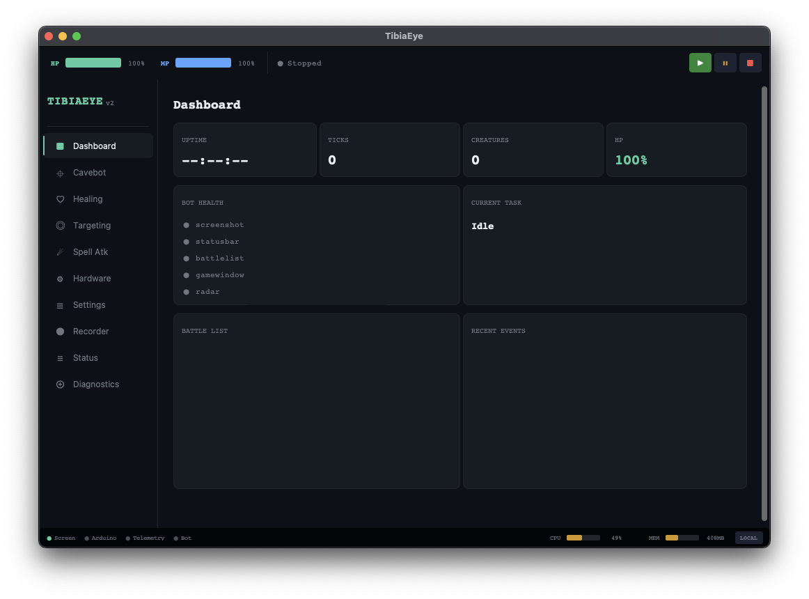
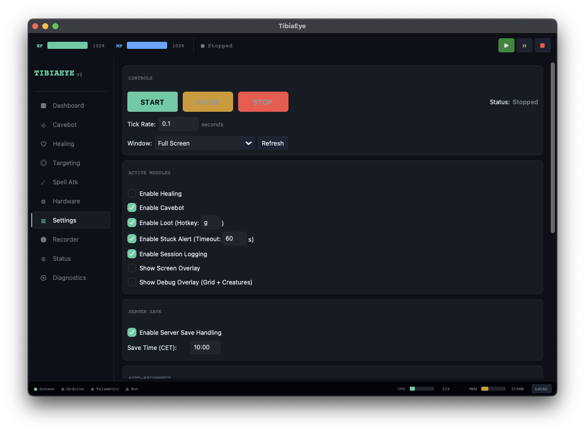
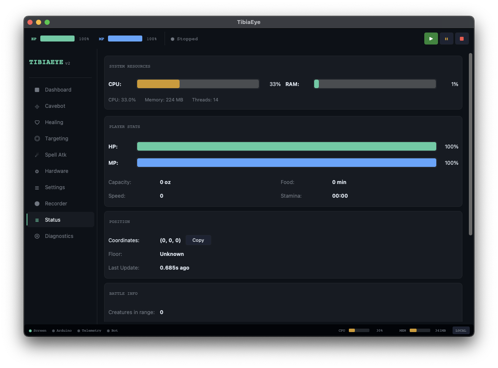
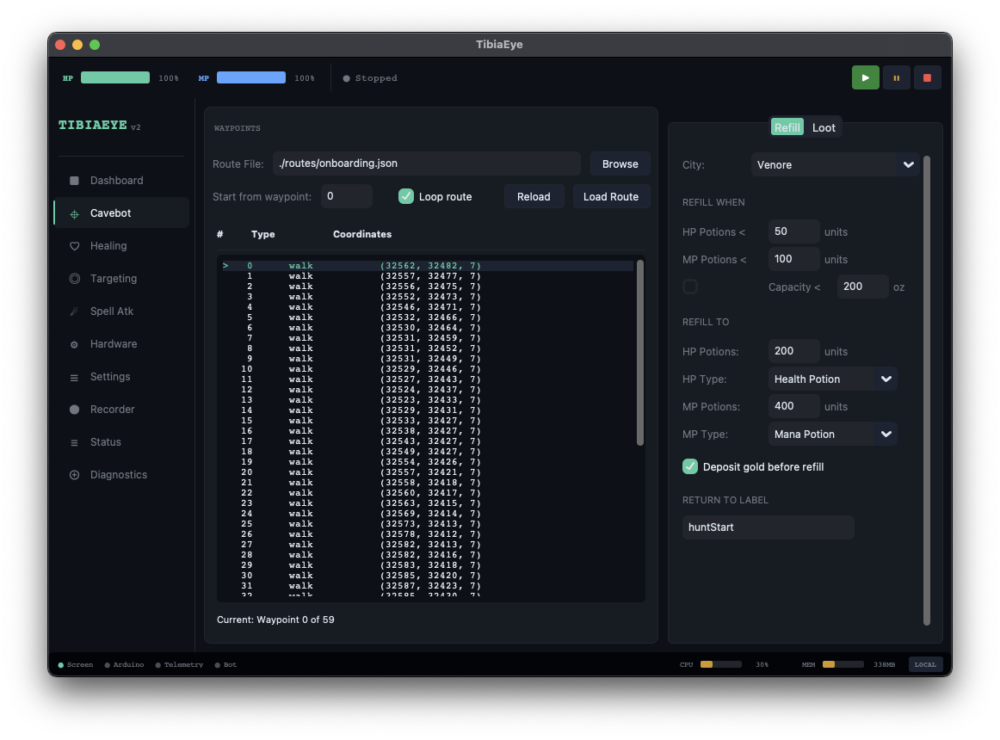
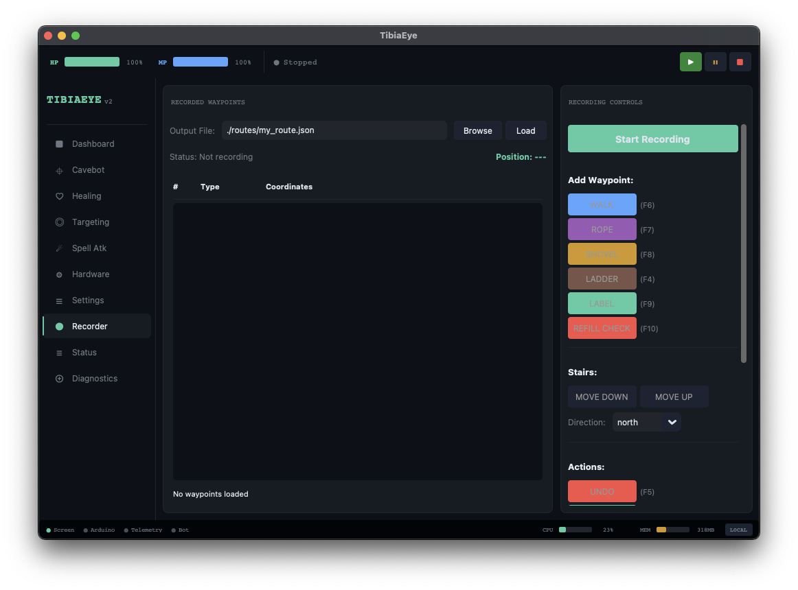
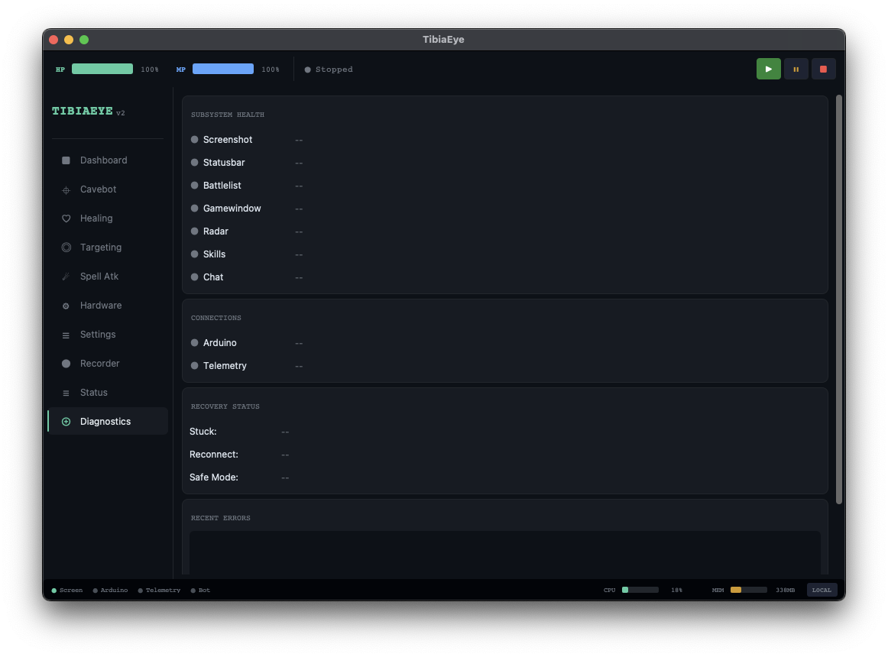
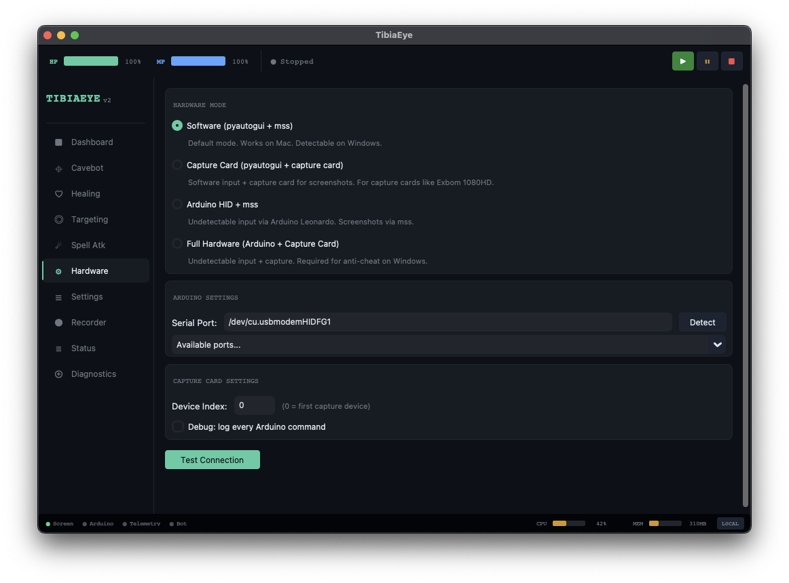

# 🤖 TibiaEye

> A full-featured bot for the MMORPG [Tibia](https://www.tibia.com), built in Python using computer vision, a hardware-level anti-detection layer, and real-time telemetry. Originally a **study project** to deeply learn systems programming, computer vision, and game automation.



---

## ⚠️ Disclaimer — Read Before Using

This bot was used in **production on a global server character**. The character **was banned after ~30 consecutive hours of hunting**.

Even with hardware-level anti-detection (Arduino Leonardo as a USB HID device + capture card), **BattleEye can detect non-human behavioral patterns**. Running a bot for 30 straight hours is obviously not human. My recommendation: if you use this, use it in short, controlled sessions and add stamina-based breaks.

> 🔴 **Use at your own risk. Botting violates Tibia's Terms of Service.**

---

## 🎯 What I Learned

This project started as a way to learn things I'd been curious about for a long time — things you can't just read about, you have to build.

### 👁️ Computer Vision

| Technique | What I learned |
|-----------|----------------|
| **Template Matching** | Sliding window search comparing saved templates pixel-by-pixel against a screenshot. Grayscale images significantly speed this up — less color data = fewer comparisons. |
| **Image Hashing (FarmHash64)** | O(1) creature lookup by hashing the name strip from the BattleList. Way faster than template matching for known creatures. |
| **OCR via pixel analysis** | Reading numbers (HP, level, stamina…) by matching digit templates against regions of the screen. |
| **HSV color filtering** | Detecting HP/Mana bar percentages by analyzing specific pixel colors in known positions. |
| **Grayscale optimization** | Template matching compares pixel by pixel — reducing 3 channels to 1 gives ~3x speedup. |

### ⚡ Performance Engineering

- **Numba `@njit`** — JIT-compiled Python to machine code for hot paths (BFS pathfinding, bar detection, slot counting). Achieved **2–10x speedups** on bottleneck functions.
- **Adaptive tick rate** — 80ms during combat, 100ms normally, 150ms idle, 500ms paused.
- **Middleware frequencies** — not every system runs every tick. HP every tick, creatures every 2 ticks, radar every 3, skills every 10.

### 🗺️ Pathfinding

- **A\*** for high-level navigation between waypoints (via `tcod`).
- **BFS flood fill** (`@njit`) for walkable grid analysis inside the game window.

Key concepts I internalized:
- **G cost** = distance from start
- **H cost (heuristic)** = estimated distance to goal
- **F cost** = G + H — what A\* minimizes

### 🔧 Systems Engineering

- Cross-platform capture pipeline (macOS native vs. Windows capture card — different pixel pipelines, same interface)
- Hardware abstraction layer — transparent switching between `pyautogui`, Arduino HID, and capture card with zero changes to game logic
- Module reload tricks for runtime platform switching in tests
- How `__init__.py` works as a facade: controls exports and runs setup code on import

### ⚙️ The Hard Part: Performance vs. Effectiveness

The goal was a **lightweight bot** — something that could run in the background without hammering the machine. That turned out to be one of the hardest problems to get right.

Computer vision is inherently heavy. Template matching, BFS pathfinding, OCR over multiple screen regions — all of this runs every tick, multiple times per second. My CPU and memory usage were way higher than I wanted, and the tricky part was that **every optimization risked breaking detection accuracy**. Lower the confidence threshold to run faster → more false positives. Skip a frame to save cycles → miss a creature. It required a lot of careful tuning to find a balance that was both fast enough and reliable enough.

**Things I tried that didn't work as expected:**

- **Rewriting in Rust** — I spent some time exploring a Rust rewrite hoping for better memory management and lower overhead. The result was actually *worse* — higher CPU and memory than the Python version. I didn't invest much time here (rewriting the entire detection pipeline would've taken months), and I may have made mistakes due to inexperience with Rust. But at least for my tests, Python + Numba outperformed my Rust attempt.

- **GPU parallelization** — I explored offloading some of the CPU-bound work to the GPU to parallelize the heavier detection functions. I didn't go deep enough to make it really work — I managed some small gains but nothing meaningful for the overall loop. This is probably worth revisiting properly, but it would require a more fundamental rethink of the pipeline.

What ended up actually helping: middleware frequency tuning (not every module runs every tick), Numba JIT on the hottest paths, grayscale everywhere, and caching results that don't change frame-to-frame. Small wins that added up.

---

## ✨ Features

### 🖥️ GUI Tabs

| Tab | Description |
|-----|-------------|
| **Dashboard** | Real-time bot health — ticks, creatures, HP/MP, active pipeline modules, battle list, recent events |
| **Settings** | Start/Pause/Stop controls, tick rate, window target, module toggles (healing, cavebot, loot, overlay), server save config |
| **Cavebot** | Load/loop routes, waypoint list, refill thresholds, deposit options |
| **Healing** | Configure HP/Mana thresholds for potions and spells |
| **Targeting** | Whitelist or blacklist mode, creature list |
| **Spell Attack** | AoE vs single-target spell groups, mana reserve protection |
| **Hardware** | Choose input mode (Software / Capture Card / Arduino / Full Hardware), serial port detection |
| **Recorder** | Record waypoints live while walking — Walk, Ladder, Rope, Shovel, Stairs — exports to JSON route |
| **Status** | Live character stats: CPU/RAM, HP/MP bars, capacity, food, speed, stamina, coordinates, creatures in range |
| **Diagnostics** | Subsystem health dots, Arduino/Telemetry connection status, stuck/reconnect/safe-mode flags, recent errors |

### 🎮 Bot Automation

| Feature | Description |
|---------|-------------|
| **Cavebot** | Route-based navigation with looping, depot return, holes/ropes/stairs/ladders |
| **Auto-healing** | Observer pattern — reacts to HP/Mana drops. Spells + potions with configurable thresholds |
| **Targeting** | Whitelist or blacklist. Attacks nearest creature in range |
| **Spell attack** | Configurable AoE and single-target spell groups with mana reserve |
| **Loot system** | Opens corpses, collects selected items |
| **Auto-refill** | Goes to NPC when potions run low, buys stock, deposits gold/loot, returns to hunt |
| **Stuck detection** | Detects movement freeze and triggers audio alert |
| **Anti-trap** | Detects when surrounded and attempts escape |
| **Server save** | Detects save time, gracefully disconnects, reconnects after |
| **Auto-reconnect** | Logs back in automatically after disconnection |
| **Food auto-eat** | Keeps character fed |

### 👁️ Visual Detection Pipeline

| Module | What it detects |
|--------|----------------|
| **BattleList** | Creature names — FarmHash64 O(1) lookup + template matching fallback for hash collisions |
| **GameWindow** | Creature positions, HP bars, walkable tiles |
| **StatusBar** | HP and Mana percentages (pixel color analysis) |
| **Skills Panel** | Level, experience, HP, mana, capacity, speed, food, stamina (OCR) |
| **Radar** | Current coordinate (X, Y, Z) from minimap |
| **Inventory** | Container/backpack slot detection |
| **ActionBar** | Cooldown state |
| **Connection** | Login screen and character selection detection |

### 🔩 Hardware Anti-Detection

The GUI exposes four input modes:

| Mode | Description |
|------|-------------|
| **Software** | `pyautogui` + `mss`. Works on macOS/Linux. Detectable on Windows. |
| **Capture Card** | `pyautogui` input + capture card for screenshots. Bypasses Tibia's screenshot block on Windows. |
| **Arduino HID + mss** | Arduino Leonardo acts as a real USB keyboard/mouse. Tibia never sees Python — it sees a HID device. |
| **Full Hardware** | Arduino HID + capture card. Completely external to the PC. |

The **Arduino Leonardo** is flashed with custom HID firmware (`firmware/`) and communicates over serial at 115200 baud — one text command per line.

Despite all of this — **my character got banned**. BattleEye doesn't need to see your keyboard driver. It watches behavior. No human hunts for 30 hours straight.

---

## 📊 Telemetry & Real-time Dashboard

The bot streams data to a companion platform — **[tibiaeye-monorepo](https://github.com/GGotha/tibiaeye-monorepo)** — via HTTP + WebSocket:

- Kill events, loot, XP — batched HTTP
- Live character position — WebSocket (every tick)
- **Livemap** — real-time map of where your character is walking
- XP/h charts, kill counts, session history, browser notifications (death, low HP, stuck)

---

## 🗂️ Architecture

```
src/
├── repositories/     # Visual data extraction (pure functions + thin facade)
│   ├── battlelist/   # FarmHash64 + template matching
│   ├── gamewindow/   # BFS pathfinding, creature bar detection
│   ├── statusbar/    # HP/Mana % from pixel colors
│   ├── skills/       # OCR digit recognition
│   ├── radar/        # Minimap coordinate extraction
│   └── inventory/    # Container slot detection
├── gameplay/         # Bot logic (functional pipeline)
│   ├── gameloop.py   # Middleware pipeline (Context → Context)
│   ├── cavebot/      # Navigation + combat decisions
│   └── core/tasks/   # Stateful task system (the only OOP layer)
├── healing/          # Auto-heal observers
├── hardware/         # Abstraction: software / Arduino / capture card
├── telemetry/        # HTTP + WebSocket data streaming
├── gui/              # CustomTkinter interface
└── wiki/             # Static game data (creatures, spells, cities)
```

The game loop is a **pure functional middleware pipeline** — each step is `Context → Context`, inspired by [PyTibia](https://github.com/lucasmonstro/PyTibia):

```
Screenshot → StatusBar → BattleList → GameWindow → Radar → Skills
                                                            ↓
                                                    handle_cavebot()
                                                            ↓
                                                    orchestrator.do()
                                                            ↓
                                                    Healing observers
```

---

## 🧪 E2E Visual Testing Framework

As the detection modules grew — BattleList, GameWindow, StatusBar, Skills panel, Radar, ActionBar, Pathfinding — **manually verifying each one after every change became painful and slow**. I'd tweak the HP bar detection, run the bot, stare at the screen, and still not be sure if the skills OCR had regressed.

The real challenge wasn't testing a single module in isolation. It was the **combinatorial explosion of scenarios** that all needed to work correctly at the same time:

- BattleList with 1 monster, 2, 4, 9 — and with zero monsters
- BattleList while actively attacking vs. not attacking
- GameWindow with a monster visible and a clear HP bar
- GameWindow with multiple monsters overlapping, or a monster at low HP
- GameWindow while running away from a monster vs. engaging it
- StatusBar at 100% HP, at 30% (healing threshold), at critical levels
- Skills panel with different stamina values, different capacity amounts
- Radar identifying the correct floor and coordinate
- The full gameplay decision: given this exact screenshot, does the bot choose to attack, walk, or refill?

Every time I changed something in creature detection, I had to mentally replay all these scenarios and manually confirm nothing broke. It was slow, error-prone, and I kept catching regressions too late.

So I built a custom E2E framework (`e2e/`) that runs the full detection pipeline against a library of **real game screenshots** captured on both macOS and Windows.

The problem it solved: instead of launching the bot and eyeballing results, I could run a single command and immediately know which modules were working, which had regressed, and exactly what each one was returning — with visual annotated output images to inspect.

**How it works:**

1. Each screenshot has a companion `.expected.json` describing what the bot *should* detect in that scene (creature count, names, HP range, skills values, pathfinding decision, etc.)
2. The runner imports directly from `src/repositories/` — zero reimplementation, tests the real code
3. Results are compared against expectations and any mismatch is flagged as a regression
4. Annotated images are generated with overlays showing detected bars, creature bounding boxes, BFS walkable grid, path to target, and skills values — making it visual and fast to diagnose

```bash
# Run all scenarios
python e2e/main.py

# Filter by OS, image, or module
python e2e/main.py --os macos
python e2e/main.py --image rotworm
python e2e/main.py --module battlelist

# Visual output with annotated overlays
python e2e/main.py --image rotworm --side-by-side

# Update expected values after an intentional change
python e2e/main.py --update-expected

# Capture a new screenshot into the suite
python e2e/capture.py --os macos --name new_scenario
```

**What each module validates:**

| Module | Checks |
|--------|--------|
| `battlelist` | Exact creature count, names (set equality), attack target |
| `gamewindow` | Creature count, false positives, HP bar noise, attack state |
| `statusbar` | HP and Mana within expected range |
| `skills` | Exact values — level, XP, HP, mana, capacity, speed, stamina |
| `radar` | Coordinate found |
| `pathfinding` | Walkable tile count, path exists, path length |
| `gameplay` | Correct decision (attack/walk/refill), correct target, task sequence |

Screenshots are split by OS (`macos/`, `windows/`) because the capture method changes pixel values — macOS uses the native screen capture API, Windows goes through a capture card.

The framework works well for this use case. There's definitely room to improve it — better diff output, coverage tracking per creature, parallel execution — but it already saved a lot of manual testing time and caught several regressions during development.

---

## 🚀 Setup

```bash
git clone https://github.com/GGotha/tibiaeye.git
cd tibiaeye

python -m venv venv
source venv/bin/activate       # macOS/Linux
# venv\Scripts\activate        # Windows

pip install -r requirements.txt

python gui.py                  # GUI mode
python main.py --help          # CLI mode
```

### Dry run

`--dry-run` (works with both `gui.py` and `main.py`) runs the full detection and decision pipeline but prints every key press, click and mouse move as `[DRY RUN] press('3')` instead of sending it. Use it to check hotkeys, targeting and waypoints before letting the bot touch the game. Arduino input is skipped while it is active.

```bash
python main.py --dry-run --no-cavebot   # watch what healing would press
python gui.py --dry-run
```

### Arduino setup

1. Flash `firmware/tibiaeye_hid/tibiaeye_hid.ino` to an **Arduino Leonardo** via Arduino IDE.
2. Connect via USB.
3. In the GUI → Hardware tab, select the mode and serial port.

---

## ⏸️ Project Status

I genuinely enjoyed building this — the computer vision pipeline, hardware abstraction, pathfinding, Numba JIT, a real visual testing framework. There's still a lot I wanted to explore: stamina-aware character rotation, smarter anti-detection heuristics, deeper pathfinding algorithms.

But other priorities in life got in the way and I had to step back. I intend to return to this project and the broader study of bot engineering and algorithmic performance in the future.

---

## 💡 Planned Features (not implemented)

- **Stamina-based auto-logout** — detect when stamina drops below X → walk to depot → logout → switch to alt character. This would've avoided the ban.
- Death detection + recovery flow
- Player detection (log out if another player enters the hunt area)
- Combo spell sequencing

---

## 🛠️ Tech Stack

| Layer | Technology |
|-------|------------|
| Computer vision | OpenCV, NumPy |
| Performance | Numba JIT (`@njit`) |
| Hashing | FarmHash64 (`pyfarmhash`) |
| Pathfinding | tcod (A\*), custom BFS (Numba) |
| GUI | CustomTkinter |
| Screen capture | mss (macOS/Linux), OpenCV capture card (Windows) |
| Hardware | Arduino Leonardo, `pyserial` |
| Telemetry | `requests`, `websocket-client` |
| Testing | pytest, custom E2E visual framework |

---

## 🔗 Related Projects

| Project | Description |
|---------|-------------|
| [tibiaeye-monorepo](https://github.com/GGotha/tibiaeye-monorepo) | Node.js monorepo — NestJS API + React dashboard + livemap |
| [PyTibia](https://github.com/lucasmonstro/PyTibia) | The original open-source bot this project was inspired by |

---

## 📖 References

- [PyTibia](https://github.com/lucasmonstro/PyTibia)
- [OpenCV Template Matching](https://docs.opencv.org/4.x/d4/dc6/tutorial_py_template_matching.html)
- [Numba JIT](https://numba.readthedocs.io/)
- [tcod pathfinding](https://python-tcod.readthedocs.io/)

---

## 🖼️ Screenshots

<table>
  <tr>
    <td align="center"><br><sub><b>Settings</b></sub></td>
    <td align="center"><br><sub><b>Live Status</b></sub></td>
  </tr>
  <tr>
    <td align="center"><br><sub><b>Cavebot & Routes</b></sub></td>
    <td align="center"><br><sub><b>Route Recorder</b></sub></td>
  </tr>
  <tr>
    <td align="center"><br><sub><b>Diagnostics</b></sub></td>
    <td align="center"><br><sub><b>Hardware Modes</b></sub></td>
  </tr>
</table>

---

*Built for learning. Used in production. Got banned.*
